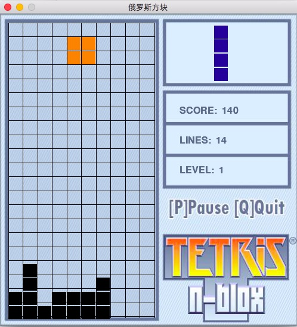

# 俄罗斯方块
## 1.项目依赖：
- Python 2.7.X
- numpy 
- pygame

## 2.安装说明：
- Python [廖雪峰 - 安装教程](https://www.liaoxuefeng.com/wiki/001374738125095c955c1e6d8bb493182103fac9270762a000/001374738150500472fd5785c194ebea336061163a8a974000)
- pip install -r requirements.txt

## 3.操作说明：
- 1.启动游戏：
	- python game.py
- 2.方块控制：
	- 上键旋转
	- 下键下落
	- 左键向左移动
	- 右键向右移动
- 3.游戏控制：
	- p 暂停
	- q 退出
	- r 重新开始

## 4.其他说明：
	1.每消除一行得10分 会有短暂的爆炸效果💥
	2.消除20行升一级
	3.每升一级下落速度快 (级数 * 0.07)

## 5.运行效果：

## 6.有待优化项：
- Game Over时的一系列操作
- 增加游戏音效
- 。。。。。。。

